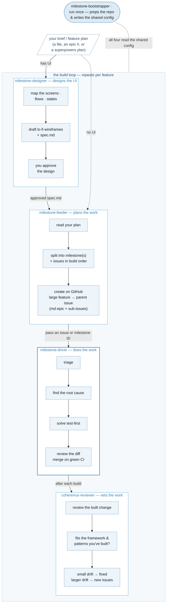

<p align="center">
  
</p>

A single Claude Code plugin **marketplace** that catalogs the milestone dev-tools suite — [`milestone-bootstrapper`](https://github.com/kenmulford/milestone-bootstrapper), [`milestone-designer`](https://github.com/kenmulford/milestone-designer), [`milestone-feeder`](https://github.com/kenmulford/milestone-feeder), [`milestone-driver`](https://github.com/kenmulford/milestone-driver), and [`milestone-coherence-reviewer`](https://github.com/kenmulford/milestone-coherence-reviewer) — so you add **one** marketplace and install the whole suite. The plugins live in their own repos; this repo is just the catalog.

## Plugins

- **[milestone-bootstrapper](https://github.com/kenmulford/milestone-bootstrapper)** — bootstrap a repo's project brain (standing docs).
- **[milestone-designer](https://github.com/kenmulford/milestone-designer)** — design a feature (spec + lo-fi wireframes) before it's decomposed into issues.
- **[milestone-feeder](https://github.com/kenmulford/milestone-feeder)** — plan features into milestones of well-formed issues.
- **[milestone-driver](https://github.com/kenmulford/milestone-driver)** — drive milestone issues to merged PRs.
- **[milestone-coherence-reviewer](https://github.com/kenmulford/milestone-coherence-reviewer)** — review a built change for fit with how the app is already built.



## Install

**First install `superpowers`** — every plugin but the designer needs it, and it's a manual prerequisite (not auto-installed): add the `claude-plugins-official` marketplace and install `superpowers` from it. Then install the suite:

```
/plugin marketplace add kenmulford/milestone-suite
/plugin install milestone-bootstrapper@milestone-suite
/plugin install milestone-designer@milestone-suite
/plugin install milestone-feeder@milestone-suite
/plugin install milestone-driver@milestone-suite
/plugin install milestone-coherence-reviewer@milestone-suite
```

(The marketplace manifest's `$schema` field is for tooling discovery — the URL isn't a resolvable schema yet, so CI's FLOOR tier is what actually enforces the manifest's structural invariants.)

Each plugin also remains individually installable from its own repo.

Each plugin except the designer also needs the GitHub CLI (`gh`) installed and signed in — the designer only touches GitHub to read an epic-issue brief. Restart Claude Code after installing so the plugins load. Every plugin's README lists its own exact prerequisites.

## How to use the suite

The build plugins run in order — the designer slots in front of the feeder when the feature has a UI — and the coherence-reviewer runs after each change is built. You set your project up once with the bootstrapper — it writes the standing docs under `.project/` and the shared config under `.milestone-config/`, and the designer, feeder, driver, and coherence-reviewer all read those. Capture how the project is built once, and every step after it grounds in that instead of guessing.

1. **Bootstrap your project brain** — [`milestone-bootstrapper`](https://github.com/kenmulford/milestone-bootstrapper)

   Capture how your project is built — conventions, architecture, framework decisions — into `.project/` docs, and make the repo ready to build in: labels, an integration and a protected branch, a CI workflow, and branch protection. Run it once, and again when the project changes.

   ```
   /milestone-bootstrapper:plan      # interviews you, then previews everything it would write
   /milestone-bootstrapper:apply     # writes the docs, config, labels, branches, and CI
   /milestone-bootstrapper:update    # re-runs when the project changes, syncing the docs
   /milestone-bootstrapper:check     # read-only: flags when the docs/config have drifted from the repo
   ```

**Before you plan a UI feature (optional)** — [`milestone-designer`](https://github.com/kenmulford/milestone-designer)

   Hand it the same brief you'll hand the feeder. It maps the screens, flows, and states the brief implies, resolves the UX gaps that have a conventional default, and writes a design spec plus lo-fi wireframes it opens in your browser — nothing is committed or handed downstream until you approve. The feeder then grounds its plan on the spec, so missing screens, empty states, and unwritten flows become issues instead of late-stage rework. No UI surface (no filled `design-system.md`)? It exits without writing anything.

   ```
   /milestone-designer:design mybrief.md   # brief → spec + lo-fi wireframes, blocks on your approval
   /milestone-designer:setup               # inspect or tune the config (the first design run writes it)
   ```

2. **Plan a milestone** — [`milestone-feeder`](https://github.com/kenmulford/milestone-feeder)

   Hand it an idea — a file, a few lines, or a GitHub epic issue. It reads your `.project/` docs — and the designer's spec when one exists — breaks the idea into small issues in build order, and writes a plan you read. Tell it to go and it creates the milestone and its issues on GitHub.

   ```
   /milestone-feeder:plan myidea.md     # idea → a reviewable plan file (nothing on GitHub yet)
   /milestone-feeder:create myidea.md   # builds the milestone and issues on GitHub
   ```

3. **Drive the milestone** — [`milestone-driver`](https://github.com/kenmulford/milestone-driver)

   Hand it the milestone the feeder built. It works each issue to a merged PR the same controlled way every time — triages for gaps, finds the root cause, has a subagent write the change test-first, reviews the diff, and merges to your integration branch when CI is green. UI issues stop for your visual sign-off, risky calls park instead of guessing, and your protected branch is never touched.

   ```
   /milestone-driver:solve-milestone "myapp v1.0.0"   # the milestone name the feeder set
   /milestone-driver:solve-issue 58                   # or drive a single issue
   ```

**After a change is built (optional)** — [`milestone-coherence-reviewer`](https://github.com/kenmulford/milestone-coherence-reviewer)

   Checks whether a built change fits how the rest of the app is already built — the helpers, patterns, and conventions it should have reused. It fixes small drift inline and files bigger drift as issues, and never blocks the merge. The driver runs it for you during a build; run it yourself to review any branch or PR.

   ```
   /milestone-coherence-reviewer:review <branch-or-PR>   # review a built change for fit
   /milestone-coherence-reviewer:sweep [pattern]         # opt-in: scan the whole app for the same drift
   ```

Each plugin's README has the full walkthrough — every command, its prerequisites, and how to set it up.
